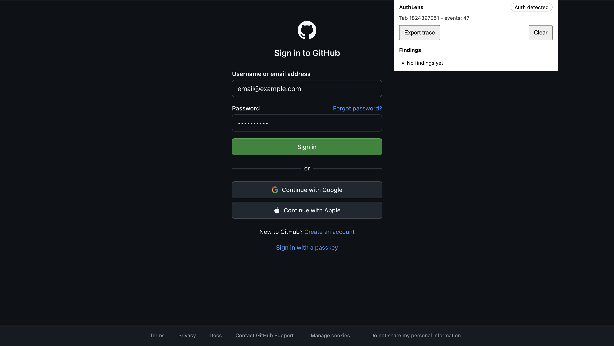
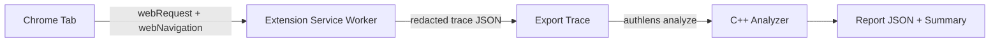

# AuthLens

AuthLens is a Chrome Extension plus a C++ analyzer that detects OAuth/OIDC flow issues and exports a redacted trace for offline analysis.

## First 30 seconds

- What it does: observes OAuth/OIDC redirects, tokens, and cookies, then surfaces findings like missing state/nonce/PKCE and token leakage.
- Screenshot: `docs/assets/screenshot-authlens.png`
- Demo link: `docs/assets/demo-authlens.mp4`




Demo (MP4): `docs/assets/demo-authlens.mp4`

## Architecture



Tradeoffs (short):
- MV3 observer-only design avoids blocking requests but limits deep request-body inspection.
- Redaction in the extension reduces privacy risk but can obscure some diagnostics.
- Analyzer is isolated in C++ for performance and auditability, but adds an extra step.

## Privacy and permissions

Default posture:
- Allowlist mode is enabled by default and capture is disabled until the user configures domains.
- Host permissions remain broad to support dynamic allowlisting; onboarding makes this explicit.

Permission justification:
- `webRequest` + `webNavigation`: observe redirects and headers for auth flows.
- `tabs` + `storage`: per-tab trace state in session storage.
- `downloads`: export redacted traces on demand.

## Security and privacy

Threat model (tool-level):
- Capturing sensitive OAuth artifacts in the trace.
- Leaking traces to unintended parties.
- Collecting more data than necessary.

Mitigations:
- Mandatory redaction of code, tokens, client_secret, and Authorization headers.
- No request body values stored; only field names when available.
- Allowlist required before capture and traces stored in session storage only.
- Export is user-initiated and produces a local file only.

Redaction invariants:
- We never store secrets in the trace.
- Redaction runs before any export.

See `docs/privacy.md` for details.

## Findings and confidence

Each finding includes a confidence level (HIGH/MED/LOW) to separate strong signals from heuristics.

## Accessibility

Checklist:
- Keyboard navigation: Not yet validated
- Visible focus rings: Not yet validated
- ARIA live region for findings updates: Not yet validated
- No color-only severity indicators: Not yet validated
- Copy/export buttons announce success: Not yet validated

What I tested:
- Not yet validated

## Testing

- Unit: URL parsing, redaction guarantees, allowlist matching, rule triggers.
- Integration: feed a known trace to the analyzer and compare to golden report.
- E2E: Not yet validated (real OAuth flow with a demo client).

## CI and releases

- CI builds the extension, runs unit tests, builds the analyzer, and runs the integration test.
- Release workflow builds artifacts for tagged releases (extension zip + analyzer binaries).

## Performance

Simple p50/p99 table (placeholders):

| Area | p50 | p99 | Notes |
| --- | --- | --- | --- |
| Analyzer runtime (sample trace) | 3.54 ms | 6.73 ms | Hyperfine mean 3.66 ms, min 3.10 ms, max 9.13 ms (402 runs) |
| Analyzer runtime (broken sample) | 4.61 ms | 28.19 ms | Hyperfine mean 6.03 ms, min 4.03 ms, max 75.21 ms (392 runs) |
| Popup render | 71.70 ms | 113.90 ms | 10 samples via console log; range 63.40–113.90 ms |

## Repo layout

- `extension/`: Chrome Extension (MV3, TypeScript)
- `analyzer/`: C++ CLI analyzer
- `docs/`: Architecture, rulebook, and privacy notes
- `samples/`: Sanitized traces

## Build the extension

```
cd extension
npm install
npm run build
```

Load `extension/dist` via chrome://extensions.

## Build the analyzer

1) Download nlohmann/json single-header and save as `analyzer/third_party/json.hpp`.
2) Build:

```
cd analyzer
cmake -S . -B build
cmake --build build -j
```

Run:

```
./build/authlens analyze /path/to/trace.json --out report.json
```
