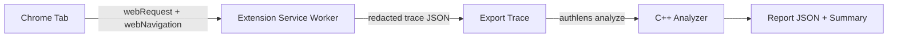

# AuthLens

AuthLens is a Chrome Extension plus a C++ analyzer that detects OAuth/OIDC flow issues and exports a redacted trace for offline analysis.

## First 30 seconds

- What it does: observes OAuth/OIDC redirects, tokens, and cookies, then surfaces findings like missing state/nonce/PKCE and token leakage.
- Screenshot: TODO (placeholder path: docs/assets/screenshot-placeholder.png)
- Demo link: TODO (placeholder)

## Architecture



Tradeoffs (short):
- MV3 observer-only design avoids blocking requests but limits deep request-body inspection.
- Redaction in the extension reduces privacy risk but can obscure some diagnostics.
- Analyzer is isolated in C++ for performance and auditability, but adds an extra step.

## Security and privacy

Threat model (tool-level):
- Capturing sensitive OAuth artifacts in the trace.
- Leaking traces to unintended parties.
- Collecting more data than necessary.

Mitigations:
- Mandatory redaction of code, tokens, client_secret, and Authorization headers.
- Store per-tab traces in session storage only, not persistent sync.
- Export is user-initiated and produces a local file only.
- Allowlist mode (options page) limits capture to approved domains.

See `docs/privacy.md` for redaction details.

## Accessibility

Checklist:
- Keyboard navigation: TODO
- Visible focus rings: TODO
- ARIA live region for findings updates: TODO
- No color-only severity indicators: TODO
- Copy/export buttons announce success: TODO

What I tested:
- TODO (manual keyboard testing and screen reader sweep)

## Testing

- Unit: TODO (rules, redaction, parser helpers)
- Integration: TODO (trace export -> analyzer report)
- E2E: TODO (real OAuth flow with a demo client)

## Performance

Simple p50/p99 table (placeholders):

| Area | p50 | p99 | Notes |
| --- | --- | --- | --- |
| Token minting | TBD | TBD | Analyzer runtime on exported trace |
| Introspection | TBD | TBD | Analyzer runtime on sample trace |
| UI load | TBD | TBD | Extension popup render |

## Repo layout

- `extension/`: Chrome Extension (MV3, TypeScript)
- `analyzer/`: C++ CLI analyzer
- `docs/`: Architecture, rulebook, and privacy notes
- `samples/`: Sanitized traces

## Build the extension

```
cd extension
npm install
npm run build
```

Load `extension/dist` via chrome://extensions.

## Build the analyzer

1) Download nlohmann/json single-header and save as `analyzer/third_party/json.hpp`.
2) Build:

```
cd analyzer
cmake -S . -B build
cmake --build build -j
```

Run:

```
./build/authlens analyze /path/to/trace.json --out report.json
```
